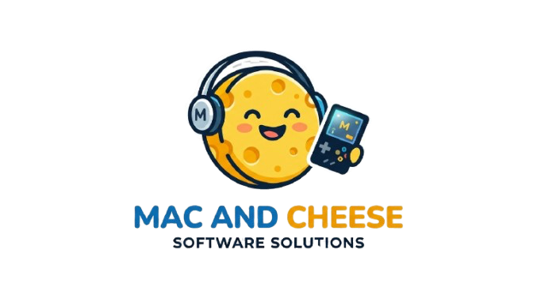

# 🧀 Mac and Cheese



**Mac and Cheese** is a macOS application that helps Nintendo 3DS developers build and package their projects into `.cia` files.

## ✨ Features

- 📦 Open ZIP projects
- 📂 Automatic extraction
- 🔨 Build using devkitPro
- 🎮 Generate `.cia` files
- 🖥️ Simple macOS interface
- 📜 Build logs
- 🎨 Custom icons and banners

## 📸 Screenshot

Place screenshots in:

```text
docs/screenshots/
```

## 📋 Requirements

- macOS 11 or newer
- Xcode
- devkitPro
- makerom
- bannertool

## 🚀 Installation

Clone the repository:

```bash
git clone https://github.com/USERNAME/MacAndCheese.git
cd MacAndCheese
```

Open in Xcode:

```bash
open MacAndCheese.xcodeproj
```

Build and run.

## 🧀 How it Works

1. Open a ZIP file containing a 3DS project.
2. Mac and Cheese extracts the project.
3. The build system runs automatically.
4. A `.cia` file is generated.

```text
ZIP
 ↓
Extract
 ↓
Build
 ↓
Banner
 ↓
CIA
```

## 📁 Project Structure

```text
MacAndCheese/
│
|docs/
├── scripts/
├── MacAndCheese/
│   ├── ContentView.swift
│   ├── BuildManager.swift
│   └── ZipExtractor.swift
│    
└── README.md
```

## 🤝 Contributing

Pull requests are welcome.

For major changes, please open an issue first to discuss what you would like to change.

## 📜 License

MIT License

## ❤️ Credits

Made with cheese, SwiftUI and Nintendo 3DS homebrew tools.

---

**Build 3DS Homebrew. Make CIA.**
